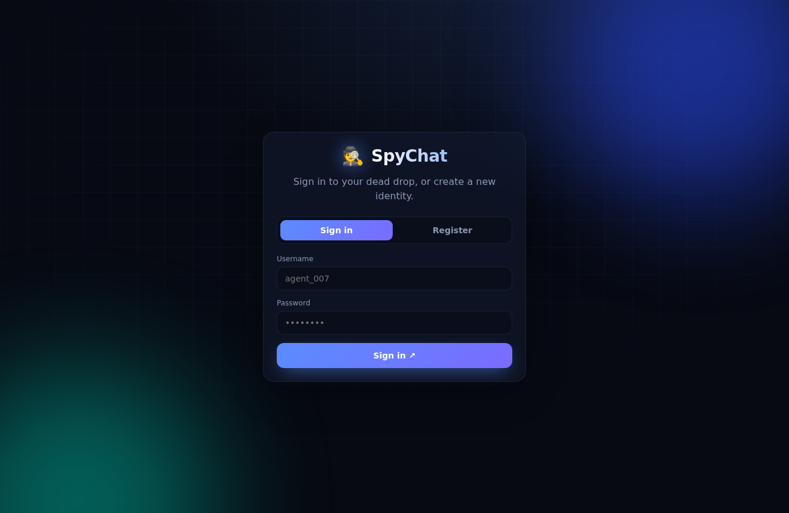
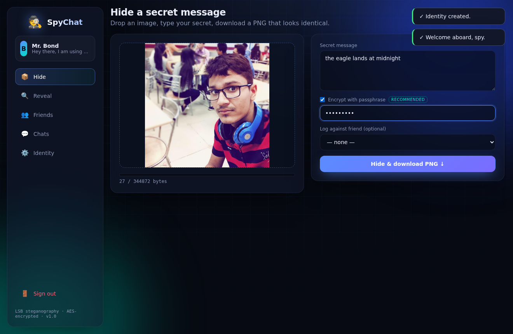

# SpyChat 🕵️

Hide secret messages **inside images**, spy-style. SpyChat conceals your text in
the pixels of a picture using least-significant-bit (LSB) steganography — the
image looks unchanged, but it carries a hidden payload only SpyChat can read
back. Optionally **encrypt** the message first, so even if someone extracts the
hidden bytes they can't read them without your passphrase.

It ships with an **ultra-modern web UI** *and* a terminal CLI, keeps a roster of
"friend" spies, logs your conversations, and persists everything to a local JSON
profile.

> Rewritten from the original Python 2 prototype: ported to Python 3, given a
> self-contained steganography engine (no unmaintained dependencies), AES
> encryption, multi-user accounts, persistence, a web app, a CLI, and a full
> test suite.

|  |  |
|---|---|
|  |  |

## Features

- 🖥️ **Modern web UI** — dark glassmorphism interface with drag-and-drop image
  upload, live capacity meter, image preview, and toast notifications.
- 👤 **Multi-user accounts** — register/login with hashed passwords; each user
  gets a fully isolated profile.
- 🛡️ **Hardened** — CSRF protection, upload size limits, decompression-bomb
  guards, session cookies, and cross-process write locking.
- 🔒 **Optional encryption** — AES (Fernet) with a scrypt-derived key; hides
  *and* protects the message.
- 🖼️ **Hide & reveal messages** in PNG/JPEG/BMP carriers (output is always
  lossless PNG so the hidden bits survive).
- ⌨️ **Terminal CLI** — interactive menu plus one-shot `encode`/`decode`.
- 💾 **Persistent profile** stored as JSON (atomic, crash-safe writes).
- ✅ **Validated rules** and clear errors; **36 passing tests**.

## Requirements

- Python 3.9+
- [Pillow](https://pypi.org/project/Pillow/) ≥ 9.0 — image manipulation
- [Flask](https://pypi.org/project/Flask/) ≥ 2.2 — web UI
- [cryptography](https://pypi.org/project/cryptography/) ≥ 3.4 — message encryption

## Installation

```bash
git clone https://github.com/kp103/spychat.git
cd spychat

python -m venv .venv && source .venv/bin/activate   # optional but recommended
pip install -e .          # installs the `spychat` command + Pillow
# or, without installing the package:
pip install -r requirements.txt
```

## Usage

### Web app (recommended)

```bash
spychat-web                   # or: python -m spychat.server
# -> open http://127.0.0.1:5000
```

Options: `--host`, `--port`, `--profile PATH`, `--debug`. Set up your spy
identity on first load, then drag an image into **Hide**, type a secret,
optionally tick **Encrypt with passphrase**, and download the PNG. Use
**Reveal** to extract a message back out.

### Interactive terminal mode

```bash
spychat                       # or: python -m spychat
```

You'll set up a spy identity on first run; your profile is saved to
`~/.spychat/profile.json` (override with `--profile PATH`). The web app and CLI
share the same profile and engine.

### One-shot encode / decode

```bash
# Hide a message (output MUST be .png or .bmp):
spychat encode samples/carrier.jpg secret.png "the eagle lands at midnight"

# Reveal it:
spychat decode secret.png
# -> the eagle lands at midnight
```

### From Python

```python
from spychat import encode, decode

encode("samples/carrier.jpg", "secret.png", "rendez-vous at 23h")
print(decode("secret.png"))   # rendez-vous at 23h
```

## How it works

Each pixel has three colour channels (R, G, B). SpyChat overwrites the
least-significant bit of each channel with one bit of your message, changing
every channel by at most 1 — imperceptible to the eye. A small header
(`SPY1` magic + 4-byte length) lets the decoder detect non-SpyChat images and
know exactly how many bytes to read.

**Important:** the carrier *output* must be lossless (PNG/BMP). Saving as JPEG
would re-compress the pixels and destroy the hidden data, so `encode` refuses
lossy output formats. A 64×64 image holds ~1.5 KB of text; larger images hold
more (`spychat.steganography.capacity_for_text`).

> ⚠️ Steganography hides the *existence* of a message but is **not** encryption
> on its own. For confidentiality, tick **Encrypt with passphrase** (web) or pass
> a passphrase to `send_message` — SpyChat then seals the text with AES (Fernet)
> using a scrypt-derived key before hiding it, so the bytes are useless without
> the passphrase.

## Deployment

The dev server (`spychat-web`) is for local use. For a real deployment, run the
WSGI app behind a production server.

**Docker (recommended):**

```bash
docker compose up --build        # serves on http://localhost:8000
```

The profile is persisted to a named volume (`spychat-data` → `/data`). To run
the image directly:

```bash
docker build -t spychat .
docker run -p 8000:8000 -v spychat-data:/data spychat
```

**Without Docker (gunicorn):**

```bash
pip install ".[prod]"
SPYCHAT_PROFILE=/var/lib/spychat/profile.json \
  gunicorn spychat.wsgi:app --bind 0.0.0.0:8000 --workers 2
```

Set `SPYCHAT_PROFILE` to control where the JSON profile is stored. Put it behind
a TLS-terminating reverse proxy (nginx/Caddy) for public exposure.

## Development

```bash
pip install -e ".[dev]"
pytest                 # run the test suite
```

### Project layout

```
spychat/
  steganography.py     # LSB embed/extract engine (Pillow only)
  crypto.py            # AES (Fernet) + scrypt passphrase encryption
  models.py            # Spy, ChatMessage, Profile dataclasses
  storage.py           # atomic JSON persistence
  app.py               # business logic + validation (I/O-free, unit-tested)
  cli.py               # argparse + interactive terminal menu
  server.py            # Flask REST API + serves the web UI
  web/
    templates/index.html
    static/style.css   # ultra-modern glassmorphism theme
    static/app.js      # single-page front-end
tests/                 # pytest suite (steganography, crypto, app, storage, API)
samples/carrier.jpg    # sample carrier image
```

## License

MIT — see [LICENSE](LICENSE).
